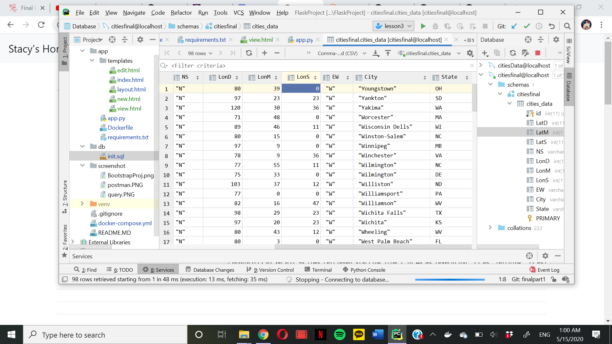
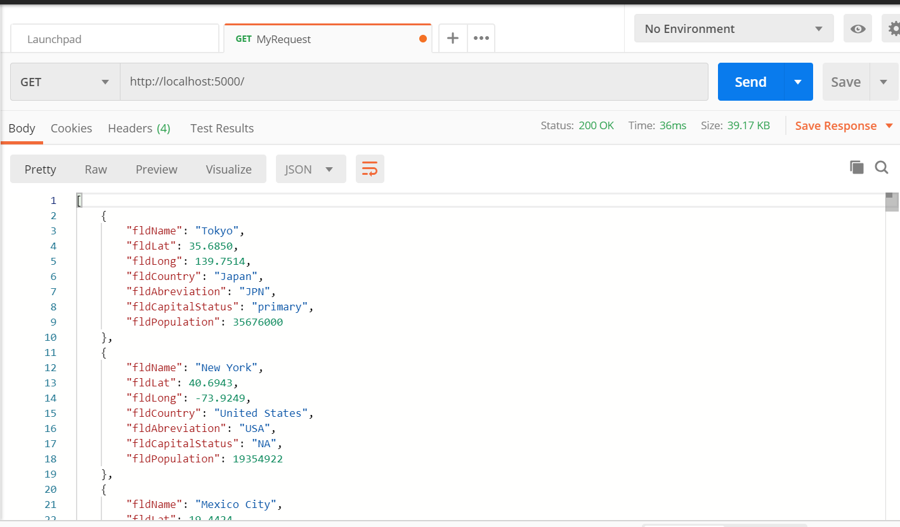

# Docker Flask Pycharm Project
this is my project

#UPDATES FOR FINAL PROJECT PART 1&2

# Add city on chrome

# Delete city on chrome

# City data on chrome

# City data on pycharm

# Postman

# Postman post

# Postman deleted

# SQL Query Screenshot

# Postman Screenshot

# Bootstrap Screenshot
