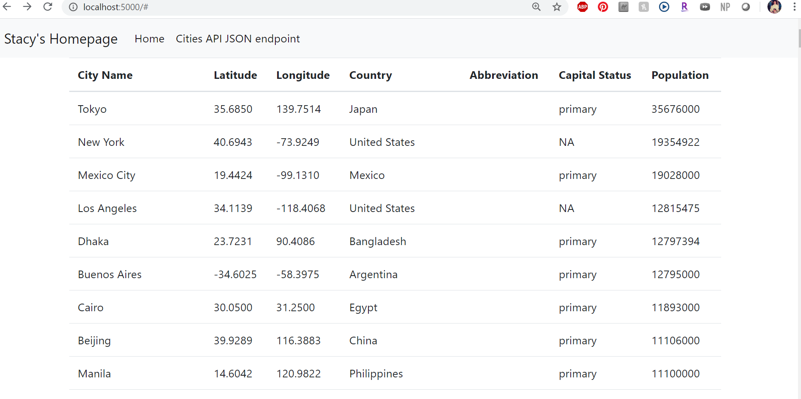

# Docker Flask Pycharm Project
this is my project

#UPDATES FOR FINAL PROJECT PART 1&2

#add city on chrome

#delete city on chrome

#city data on chrome

#city data on pycharm

#postman

#postman post

#postman deleted

# SQL Query Screenshot

# Postman Screenshot

# Bootstrap Screenshot
